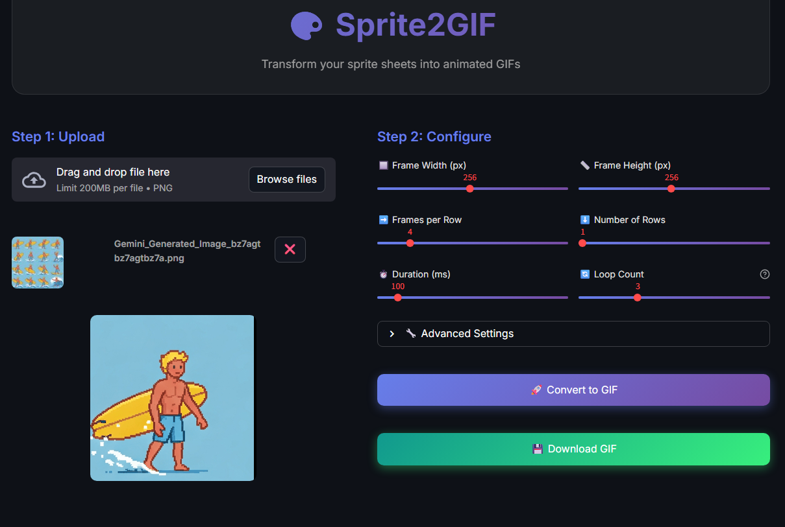

# 🎨 Sprite2GIF


> Convert sprite sheets into animated GIFs with an intuitive web interface

## 📸 Screenshot



## ✨ Features

- 🖼️ **Sprite Sheet Upload** - Support for PNG sprite sheets
- ⚙️ **Customizable Settings** - Configure frame count, duration, and loop
- 👁️ **Live Preview** - See your animation before downloading
- 💾 **Direct Download** - Get your GIF instantly
- 🎯 **User-Friendly** - Clean Streamlit interface, no coding required

## 🚀 Quick Start

### Prerequisites

- Python 3.8 or higher
- pip (Python package manager)

### Installation

```bash
# Clone the repository
git clone https://github.com/machichiotte/machi04_sprite2gif.git
cd machi04_sprite2gif

# Create virtual environment
python -m venv venv

# Activate virtual environment
# Windows:
venv\Scripts\activate
# Unix/MacOS:
source venv/bin/activate

# Install dependencies
pip install -r requirements.txt
```

### Running the App

```bash
streamlit run src/app.py
```

The app will open in your browser at `http://localhost:8501`

### 🐳 Run with Docker

```bash
# Build and start the container
docker compose up -d

# View logs
docker compose logs -f
```

The app will be available at `http://localhost:8501`

## 📖 How to Use

1. **Upload** your sprite sheet (PNG format)
2. **Configure** animation settings:
   - Number of frames in the sprite sheet
   - Frame duration (in milliseconds)
   - Loop settings (infinite or specific count)
3. **Preview** the generated animation
4. **Download** your GIF

## 🛠️ Tech Stack

- **[Streamlit](https://streamlit.io/)** - Web interface framework
- **[Pillow (PIL)](https://python-pillow.org/)** - Image processing
- **[pytest](https://pytest.org/)** - Testing framework
- **[black](https://black.readthedocs.io/)** - Code formatting
- **[flake8](https://flake8.pycqa.org/)** - Code quality

## 📁 Project Structure

```
sprite2gif/
├── src/
│   ├── app.py                 # Streamlit web interface
│   ├── sprite_converter.py    # Core conversion logic
│   └── __init__.py
├── tests/
│   └── test_sprite_converter.py
├── assets/                    # Example sprites and outputs
├── requirements.txt           # Python dependencies
└── README.md
```

## 🧪 Development

### Running Tests

```bash
pytest
```

### Code Formatting

```bash
# Format code with black
black src/ tests/

# Check code quality
flake8 src/ tests/
```

## 📝 Example

```python
from src.sprite_converter import SpriteConverter

# Create converter instance
converter = SpriteConverter('path/to/sprite_sheet.png')

# Convert to GIF
converter.convert_to_gif(
    output_path='output.gif',
    num_frames=8,
    frame_duration=100,  # milliseconds
    loop=0  # 0 = infinite loop
)
```

## 🤝 Contributing

Contributions are welcome! Feel free to:

1. Fork the project
2. Create a feature branch (`git checkout -b feature/AmazingFeature`)
3. Commit your changes (`git commit -m 'Add some AmazingFeature'`)
4. Push to the branch (`git push origin feature/AmazingFeature`)
5. Open a Pull Request

## 📄 License

This project is licensed under the MIT License - see the [LICENSE](LICENSE) file for details.

## 👤 Author

**Machi Chiotte**

- GitHub: [@machichiotte](https://github.com/machichiotte)
- Email: [machichiotte@gmail.com](mailto:machichiotte@gmail.com)

## 🙏 Acknowledgments

- [Streamlit](https://streamlit.io/) for the amazing web framework
- [Pillow](https://python-pillow.org/) for image processing capabilities

---

⭐ If you find this project useful, please give it a star!
